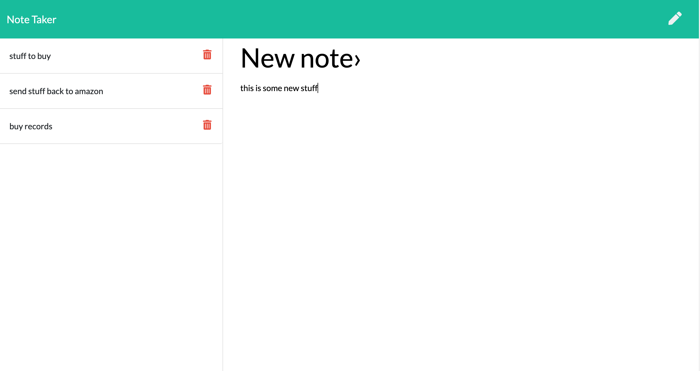

# note-taker
takes notes and stores in a database, using express for backend and json as a database.

## Specifications
- must store notes in JSON database
- must have html routes
    - `/notes`
    - `/*`
- must have api routes
    - get `/api/notes`
    - post `/api/notes`
    - delete `/api/notes/:id`
- must be deployed live on Heroku

## Technologies 
- JavaScript 
- Express for server duties 
- Fs package
- Axios for api calls
- Bootstrap for front end styling

## Screenshots

## Live Deployment
[Heroku link](https://ernesturzua-note-taker.herokuapp.com/)

